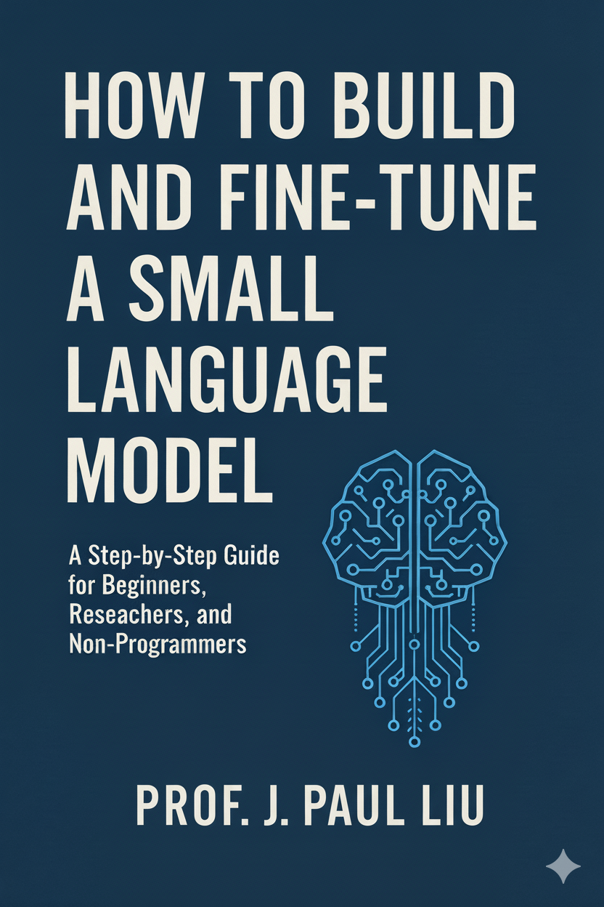

# How to Build and Fine-Tune a Small Lanugage Model

<b>How to Build and Fine-Tune a Small Lanugage Model:</b> 

 
<a href=https://leanpub.com/howtobuildandfine-tuneasmalllanguagemodel>https://leanpub.com/howtobuildandfine-tuneasmalllanguagemodel</a> 
<a href=https://www.amazon.com/dp/B0G3MYWTJK>https://www.amazon.com/dp/B0G3MYWTJK</a>
