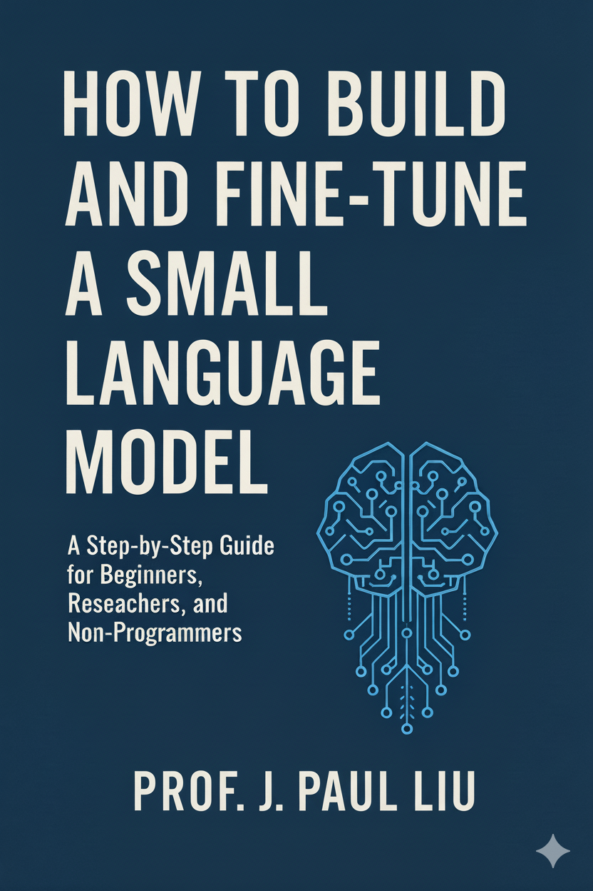

# How to Build and Fine-Tune a Small Language Model
<p align="center">
  
</p>

<h1 align="center">📖 How to Build and Fine-Tune a Small Language Model</h1>

<h3 align="center"><em>A Step-by-Step Guide for Beginners, Researchers, and Non-Programmers</em></h3>

<p align="center">
  <strong>By Dr. J. Paul Liu</strong>
</p>

<p align="center">
  
  
  
  
</p>

<p align="center">
  <a href="https://leanpub.com/howtobuildandfine-tuneasmalllanguagemodel">
    
  </a>
  &nbsp;&nbsp;
  <a href="https://www.amazon.com/dp/B0G3MYWTJK">
    
  </a>
  &nbsp;&nbsp;
  <a href="https://rewriting.ai/bookcode/slm.php">
    
  </a>
</p>

---

# 🎁 Free Interactive Google Colab Notebooks

Start building immediately with these **free, hands-on Google Colab notebooks**. No installation required—just click and run.

## 📘 Chapter 2 – Let's Build GPT from Scratch

Build a miniature GPT model from the ground up while learning:

- Tokenization
- Self-Attention
- Transformer Blocks
- Text Generation

[](https://colab.research.google.com/drive/1gxbN4v0lhMRZ-B-vIyXNvQN0s5nJd3pB)

---

## 🚀 Chapter 3 – Quick Start: Fine-Tune Your First Model

Fine-tune your first language model in Google Colab in less than 30 minutes.

You'll learn how to:

- Load a pretrained model
- Prepare your dataset
- Fine-tune the model
- Test your results

[](https://colab.research.google.com/drive/1j0VUcj7onnXh4TmqqNxLKoTWVsKIZRUO?usp=sharing)

> 🎉 **Both notebooks are completely free** and run on the Google Colab Free GPU.

---
---

## 🎯 About This Book

> *"You don't need billion-dollar infrastructure to build powerful AI."*

This book proves that **one person with a laptop, curiosity, and $10/month** can build production-quality language models that solve real problems. What started as lecture notes for a "Generative AI for Science" course evolved through real deployments—geologists analyzing hazard data, legal researchers processing court documents, historians studying archaic texts, and businesses building multilingual support systems.

**This is not an AI research paper. It's a builder's manual.**

---

## ✨ What Makes This Book Different

| Feature | Description |
|:-------:|-------------|
| 🖱️ | **Click, Run, Learn, Modify** — All code runs in Google Colab. No installations, no expensive hardware. |
| 🧠 | **Understanding Before Optimizing** — Build GPT from scratch first, then learn to customize it. |
| 💰 | **Real Constraints, Real Solutions** — Costs in dollars, training time in hours, specific GPU models. |
| ⚖️ | **Honest About Trade-offs** — When to use small models vs. APIs, local vs. cloud, scratch vs. fine-tuning. |
| 🔬 | **Battle-Tested** — Validated by hundreds of practitioners from research to production. |

---

## 📚 Complete Chapter Guide

```
📁 FOUNDATIONS
├── Chapter 1: Introduction
│   └── Why Small Language Models Matter, Use Cases, Hardware Requirements
│
├── Chapter 2: Let's Build GPT from Scratch                    ⏱️ 60 min
│   └── Tokenization → Self-Attention → Transformer Blocks → Complete GPT
│
└── Chapter 3: Quick Start – Fine-Tune Your First Model        ⏱️ 30 min
    └── Google Colab → Load Model → Prepare Data → Fine-Tune → Test

📁 CORE SKILLS
├── Chapter 4: Dataset Preparation
│   └── Tokenization Deep Dive, Data Sources, Cleaning, Quality Checks
│
├── Chapter 5: Model Architecture & Configuration
│   └── Parameters, Four Key Decisions, Pre-configured Architectures
│
├── Chapter 6: Training Loop & Monitoring
│   └── Production Training, Logging, Checkpointing, Troubleshooting
│
└── Chapter 7: Evaluation & Benchmarks
    └── Perplexity, Metrics, Baselines, Generation Quality, Readiness Checks

📁 THE THREE-STAGE PIPELINE                                    ⏱️ 20-30 hrs
├── Chapter 8: Stage 1 – Pre-training from Scratch (MiniMind)
│   └── Data Prep → Tokenizer Training → Model Training → Analysis
│
├── Chapter 9: Stage 2 – Supervised Fine-Tuning (SFT)
│   └── Task Performance, SFT Data, Training, Testing
│
└── Chapter 10: Stage 3 – Direct Preference Optimization (DPO)
    └── Alignment, Preference Data, Safety, Production Deployment

📁 PRODUCTION & ETHICS                                         ⏱️ 10-15 hrs
├── Chapter 11: Production Deployment
│   └── Optimization, Quantization (INT8), Deployment Options, Cost Analysis
│
├── Chapter 12: Complete Production Projects & Ethics
│   ├── Project 1: Medical Q&A Assistant
│   ├── Project 2: Code Documentation Generator
│   ├── Project 3: Multilingual Customer Support
│   └── Ethics, Safety & Responsible AI
│
└── Appendices
    ├── A: Resource Calculator
    ├── B: Quick Reference
    └── C: Dataset & Model Zoo
```

---

## 🎓 Who Is This Book For?

<table>
<tr>
<td width="33%" align="center">

### 🔬 Researchers
Scientists wanting AI that understands their domain—geology, law, history, biology—running on their own infrastructure.

</td>
<td width="33%" align="center">

### 💼 Practitioners
Engineers and developers building specialized AI systems without API costs or privacy concerns.

</td>
<td width="33%" align="center">

### 🎒 Beginners
Anyone who's wondered: "Can I build my own AI?" Yes, you can. This book shows you how.

</td>
</tr>
</table>

---

## 🚀 What You'll Build

By completing this book, you will:

| Milestone | Description |
|-----------|-------------|
| ✅ | Build a **working GPT model from scratch** and deeply understand transformers |
| ✅ | **Pre-train models** on custom datasets (125M–350M parameters on consumer hardware) |
| ✅ | **Fine-tune** using Supervised Fine-Tuning (SFT) |
| ✅ | **Align** models with Direct Preference Optimization (DPO) |
| ✅ | **Deploy production systems** with safety, monitoring, and ethics |
| ✅ | Navigate the **complete pipeline**: Data → Architecture → Training → Evaluation → Deployment |

---

## 💻 Requirements & Investment

<table>
<tr>
<td width="50%">

### 🛠️ What You Need
- **Hardware:** A web browser (everything runs on Google Colab free tier: T4, L4, or A100 GPUs)
- **Experience:** Curiosity. That's it.
- **Software:** All code provided as `.ipynb` notebooks

</td>
<td width="50%">

### ⏱️ Time Investment
| Phase | Duration |
|-------|----------|
| Chapter 2 (Build GPT) | ~60 minutes |
| Chapter 3 (First Fine-tune) | ~30 minutes |
| Complete Pipeline | 20-30 hours |
| Production Deployment | 10-15 hours |

**Total Cost: Under $50 to production expertise**

</td>
</tr>
</table>

---

## 📖 From the Author

> *"The barrier between 'AI user' and 'AI builder' is thinner than you think. It's not talent or resources—it's understanding and practice."*
>
> *"By Chapter 2, you'll have built a tiny but working GPT model. By Chapter 3, you'll understand why fine-tuning is revolutionary. By Chapter 10, you'll have trained a small but complete modern language model. By Chapter 12, you'll have deployed production systems."*
>
> *"But tools are only as good as the wisdom with which we wield them. Build models that respect privacy, acknowledge limitations, and fail gracefully. Let the AI propose; let humans decide; let ethics guide."*
>
> **— Dr. J. Paul Liu, Winter 2025**

---

## 🔗 Quick Links

<p align="center">

| Resource | Link |
|:--------:|:----:|
| 📚 **PDF Edition** | [Leanpub](https://leanpub.com/howtobuildandfine-tuneasmalllanguagemodel) |
| 📦 **Paperback** | [Amazon](https://www.amazon.com/dp/B0G3MYWTJK) |
| 💻 **Code Downloads** | [rewriting.ai/bookcode/slm.php](https://rewriting.ai/bookcode/slm.php) |
| 📧 **Contact** | support@rewriting.ai |

</p>

---

## 📋 How to Cite This Book

```bibtex
@book{liu2025slm,
  author    = {Liu, J. Paul},
  title     = {How to Build and Fine-Tune a Small Language Model},
  publisher = {Leanpub},
  year      = {2025},
  pages     = {479},
  isbn      = {979-8-2747-6622-7}
}
```

**Text citation:** Liu, J. Paul. 2025. *How to Build and Fine-Tune a Small Language Model*. Leanpub. 479 p.

---

## 🏷️ Topics Covered

<p align="center">
  
  
  
  
  
  
  
  
</p>

---

<p align="center">
  <strong>The future of AI isn't just in the hands of big tech. It's also in yours.</strong>
</p>

<p align="center">
  <em>Now, let's build something remarkable together.</em>
</p>

---

<p align="center">
  <sub>© 2025 Dr. J. Paul Liu. All rights reserved.</sub>
</p>

<p align="center">
  <a href="https://twitter.com/intent/tweet?text=I%20just%20started%20reading%20%22How%20to%20Build%20and%20Fine-Tune%20a%20Small%20Language%20Model%22%20by%20Prof.%20J.%20Paul%20Liu.%20A%20practical%2C%20hands-on%20guide%20to%20building%20your%20own%20LLM%20on%20accessible%20hardware.%20Excited%20to%20dive%20in!%20%23SmallLanguageModel">
    
  </a>
</p>
